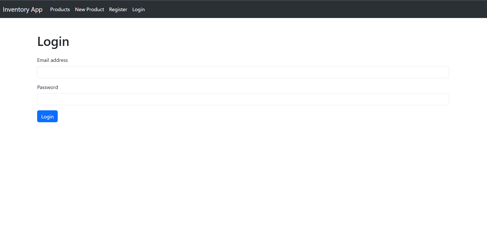
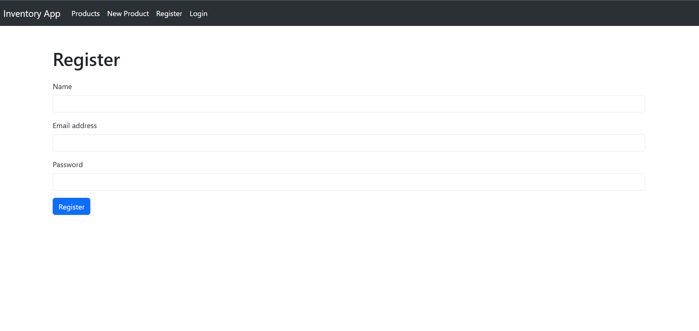
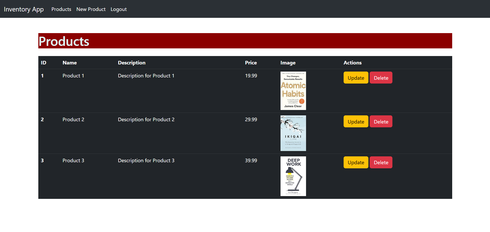
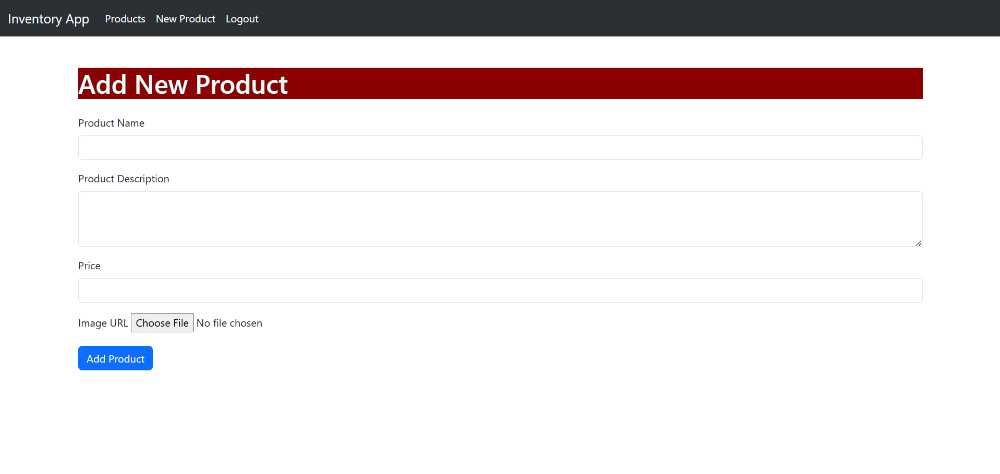

# Inventory Management App

This is an Inventory Management application built using Node.js, Express, and EJS. The application allows users to manage products, including adding, updating, and deleting products. It also includes user authentication and session management.

## Features

- User registration and login
- Add new products
- Update existing products
- Delete products
- View all products
- File upload for product images
- Session management
- Last visit tracking

## Tech Stack

- NodeJS
- ExpressJS
- EJS
- express-session
- multer
- express-validator
- cookie-parser

## API Endpoints

1. **User Endpoints**
- `GET /register` - Render the registration page
- `POST /register` - Register a new user
- `GET /login` - Render the login page
- `POST /login` - Login a user
- `GET /logout` - Logout a user

2. **Product Endpoints**
- `GET /` - Get all products (requires authentication)
- `GET /add-product` - Render the add product form (requires authentication)
- `POST /` - Add a new product (requires authentication)
- `GET /update-product/:id` - Render the update product form (requires authentication)
- `POST /update-product` - Update a product (requires authentication)
- `POST /delete-product/:id` - Delete a product (requires authentication)

## Screenshots

- **Login Page**

- **Register Page**

- **Product List**

- **New Product Page**

